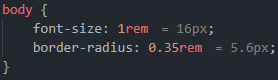

<!-- # CSS Unit Guide

 -->

 

 

# CSS Unit Guide

A Visual Studio Code extension that displays the pixel equivalent of CSS units like `rem`, `em`, and `%` next to them in your code.

> Remember to 🌟 this repository if you find it useful!

## 📌 Features

- **Automatic Conversion:** Shows pixel equivalents next to `rem`, `em`, and `%` units.
- **Multiple File Types:** Supports CSS, SCSS, and LESS files.
- **Customizable Base Font Size:** Adjust the base font size to match your project's requirements.
- **Real-Time Updates:** Automatically updates as you type or edit your code.
- **Lightweight and Efficient:** Minimal performance impact on your editor.

## 👀 Preview

## 📥 Installation

Since this is a private extension, you can install it manually:

1. **Clone or Download** the repository from [GitHub](https://github.com/Walkaisa/css-unit-guide).
2. **Build the Extension**:
   - Open a terminal in the extension's root directory.
   - Run `npm install` to install dependencies.
   - Run `npm run package` to build the extension package.
   - This will generate a `.vsix` file in the project directory.
3. **Install the Extension in VS Code**:
   - Open VS Code.
   - Go to the Extensions view (`Ctrl+Shift+X` or `Cmd+Shift+X`).
   - Click on the three dots (`...`) in the upper-right corner.
   - Select **"Install from VSIX..."**.
   - Locate and select the generated `.vsix` file.

## 💡 Usage

Simply open a CSS, SCSS, or LESS file and start typing values using "rem", "em", or "%". The extension will automatically display the corresponding pixel values next to them.

## 👨‍💻 Contributing

Contributions are welcome! Please follow these steps:

1. **Fork** the repository.
2. **Create** a new branch for your feature or bug fix.
3. **Commit** your changes with clear messages.
4. **Push** to your forked repository.
5. **Submit** a pull request to the main branch.

For major changes, please open an issue first to discuss what you'd like to change.

## 📝 Changelog

All changes and version history can be found in the [CHANGELOG](CHANGELOG.md).

## 📄 License

This project is licensed under the [MIT License](LICENSE.txt).

[vsmp-link]:                https://marketplace.visualstudio.com/items?itemName=LeonardSSH.vscord
[ovsx-link]:                https://open-vsx.org/extension/LeonardSSH/vscord

[shield-vsmp-version]:      https://img.shields.io/visual-studio-marketplace/v/LeonardSSH.vscord?label=Visual%20Studio%20Marketplace
[shield-vsmp-downloads]:    https://img.shields.io/visual-studio-marketplace/d/LeonardSSH.vscord
[shield-vsmp-installs]:     https://img.shields.io/visual-studio-marketplace/i/LeonardSSH.vscord
[shield-vsmp-rating]:       https://img.shields.io/visual-studio-marketplace/r/LeonardSSH.vscord

[shield-ovsx-version]:      https://img.shields.io/open-vsx/v/LeonardSSH/vscord?label=OpenVSX%20Marketplace
[shield-ovsx-downloads]:    https://img.shields.io/open-vsx/dt/LeonardSSH/vscord
[shield-ovsx-rating]:       https://img.shields.io/open-vsx/rating/LeonardSSH/vscord

[github-workflows-ci]:      https://github.com/leonardssh/vscord/actions/workflows/CI.yml
[shield-workflows-ci]:      https://github.com/leonardssh/vscord/actions/workflows/CI.yml/badge.svg

[github-workflows-cd]:      https://github.com/leonardssh/vscord/actions/workflows/CD.yml
[shield-workflows-cd]:      https://github.com/leonardssh/vscord/actions/workflows/CD.yml/badge.svg

[gitter-vscord-support]:    https://gitter.im/LeonardSSH/vscord-support?utm_source=badge&utm_medium=badge&utm_campaign=pr-badge
[shield-gitter-support]:    https://img.shields.io/badge/gitter-support%20chat-green?color=40aa8b